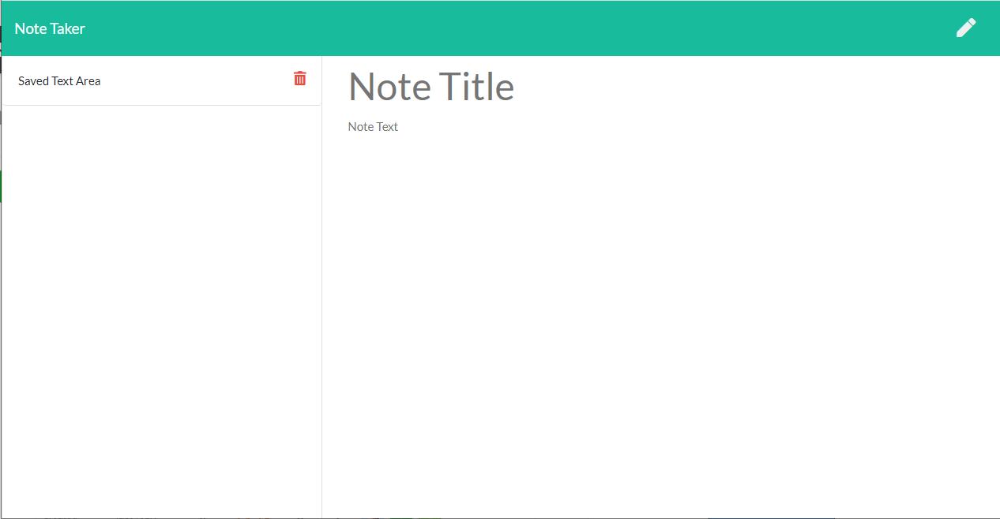

 # Reminder Notes
  ---
  * [GitHub Repository](https://github.com/MVPeter/Reminder-Notes)

  
      
  ## Table of Contents
    - Discription
    - Installation
    - Usage
    - Contributions
    - Liscense
    - Questions

  ---
  
  ## Discription

  This project uses Express to start a webserver and creates a website you can create, save, and delete notes.  The notes will save to a JSON file and be retrieved when the server reloads.

  

  ---
  
  ## Installation

  Requires: ExpressJS

  ---
  
  ### Usage

    * The application runs at a terminal, in node and can be started with ‘node server.js’.

  ---
  
  ### Tests

    * none.

  
  ### Contributions

    * Matthew Petersen, ExpressJS

  ---
  
  ### License

    * This project is covered by the following license(s): MIT
    

  ---
  
  ### Questions
  - GitHub Profile: [GitHub Profile](https://github.com/MVPeter)
  - For further questions please contact me at email:  MVPetersen1@gmail.com

  